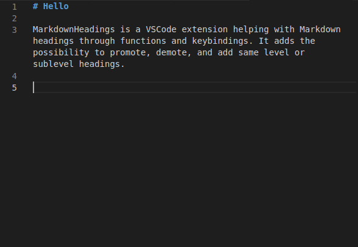

# MarkdownHeadings

MarkdownHeadings is a VSCode extension helping with Markdown headings through functions and keybindings. It adds the possibility to promote, demote, and add same level or sublevel headings.

## Features and keybindings
- **Add same level heading** (alt+enter): "MarkdownHeadings: Add same level heading"
- **Add sublevel heading** (alt+shift+enter): "MarkdownHeadings: Add sublevel heading"
- **Promote heading** (alt+leftarrow): "MarkdownHeadings: Promote heading"
- **Demote heading** (alt+rightarrow): "MarkdownHeadings: Demote heading"

Demonstration :

## Installation

For VSCode : https://marketplace.visualstudio.com/items?itemName=sbij.markdownheadings

For VSCodium : https://open-vsx.org/extension/sbij/markdownheadings/https://open-vsx.org/extension/sbij/markdownheadings/

(or just download the vsix from the VSCode link)

## Requirements
No requirements.

## Extension Settings
For now there are no settings. Except that you can change keybindings through the normal ctrl+shift+p panel. The function names are listed at the top of this file.

## Known Issues
For now there are no known issues.

## Release Notes

### 1.0.0

Initial release of MarkdownHeadings

## Thanks

* Thanks to https://github.com/vscode-org-mode/vscode-org-mode for some code inspiration

**Enjoy!**
